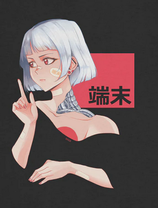

## **Me**  

 Bonjour! Bienvenue sur ma page github. Actuellement débutant mais je m'améliore de jour en jour :)

 Hello! Welcome to my github page. Currently a beginner but getting better every day :)

<h3> <u><b>Quelques faits</b></u></h3>
<ul>
<li>🔭 I’m currently working on <b>Nothing</b> 
<li> <b>Meta</b> universe</li>
<li> <b>Blue Team 🪤</b> | <b>Red Team 💣</b></li>
<li>👨‍💻 Mes projets sont disponibles sur <a href="https://github.com/lewai1">Github</a></li>
</ul>

| Nom des sites | URL des sites |
| -------------- | :--------- |
| Mon portfolio | https://........... |

## Les logiciels et langages que j'utilise

